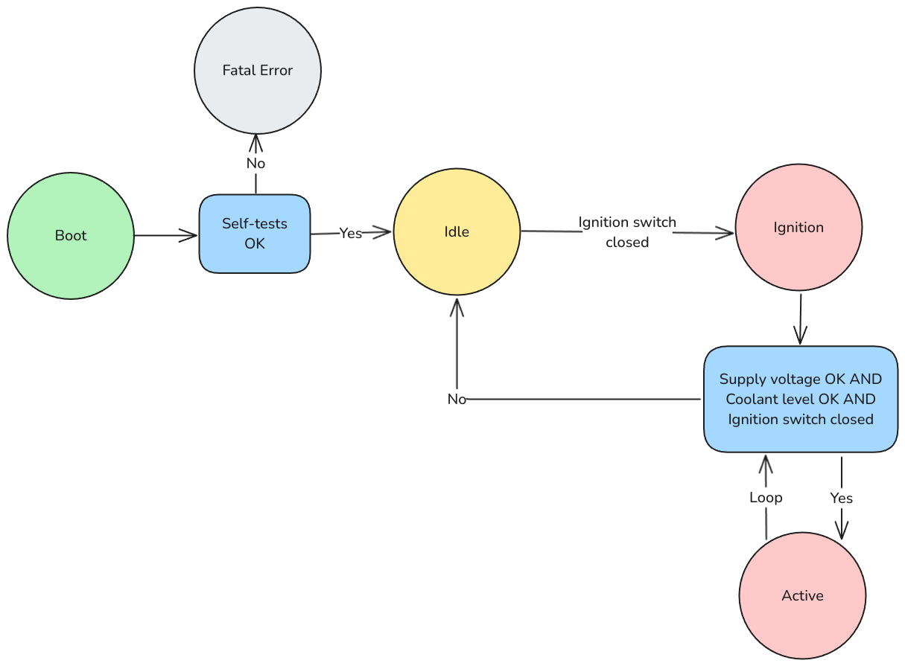

# EAE_Firmware

This is the repository containing my submission for the firmware section of the EAE Electrical & Controls challenge. I decided to tackle the optional components, and my submission covers the following:

1. Dependencies managed by CMake.
2. A finite state machine with a few basic states for controlling the cooling.
3. Basic logic for reading PLC inputs and updating PLC outputs.
4. Sending & receiving CAN messages. 
5. Basic scaffolding for a PID loop.
6. Unit tests with GoogleTests. I used [this template](https://dev.to/yanujz/getting-started-with-googletest-and-cmake-1kgg) for setting up the dependency.
7. Shell scripts for building & launching with runtime parameters.

I decided to go with an architecture that I'm familiar with: a main Finite State Machine class runs all main application routine logic, and a number of Manager classes which are each responsible for their own utilities. Aside from the main file, there are three classes:

1. The `StateManager` class for FSM. It implements a simple state machine, pictured below.
2. A `HardwareManager` class acting as a hardware abstraction interface. Most of the functions just mock reading and writing to the PLC input/outputs and sending/receiving CAN messages. In a real application, this class would likely be a lot larger and the CAN functionality may be split into its own class.
3. A `ControlManager` class that outputs a PID signal. In a real application, this class would wrap a battle-tested PID library. In this example, it just outputs mock control signals.



The tests are all contained in the `tests/main.cpp`, and only cover a few things: entering the ignition state and making sure ignition can't happen when the supply voltage or coolant levels aren't correct. In a real application, there would be many more tests split into their own folders, but for this example everything is contained in the mainf file.

## Improvements

Some potential improvements to the example:

1. Most functions return void, with outputs passed as addressed parameters that are overwritten. These functions should return an error code that can be checked by the calling context.
2. There isn't actually any queues or RTOS functionality, but there could be queues set up for incoming and outgoing CAN messages to be handled asynchronously.
3. A more complex example for determining what exactly to send to the display instead of a single message.

## Building & Running

1. Make sure that CMake and GCC is installed. On my machine (Fedora Linux), this required the following command:
```sudo dnf install cmake gcc gcc-c++```
2. Run the tests using the shell script.
```bash tests.sh```
3. Run the code using the main script, passing in the minimum supply voltage and temperature setpoint.
```bash main.sh <MIN_SUPPLY_VOLTAGE> <TEMPERATURE_SETPOINT>```